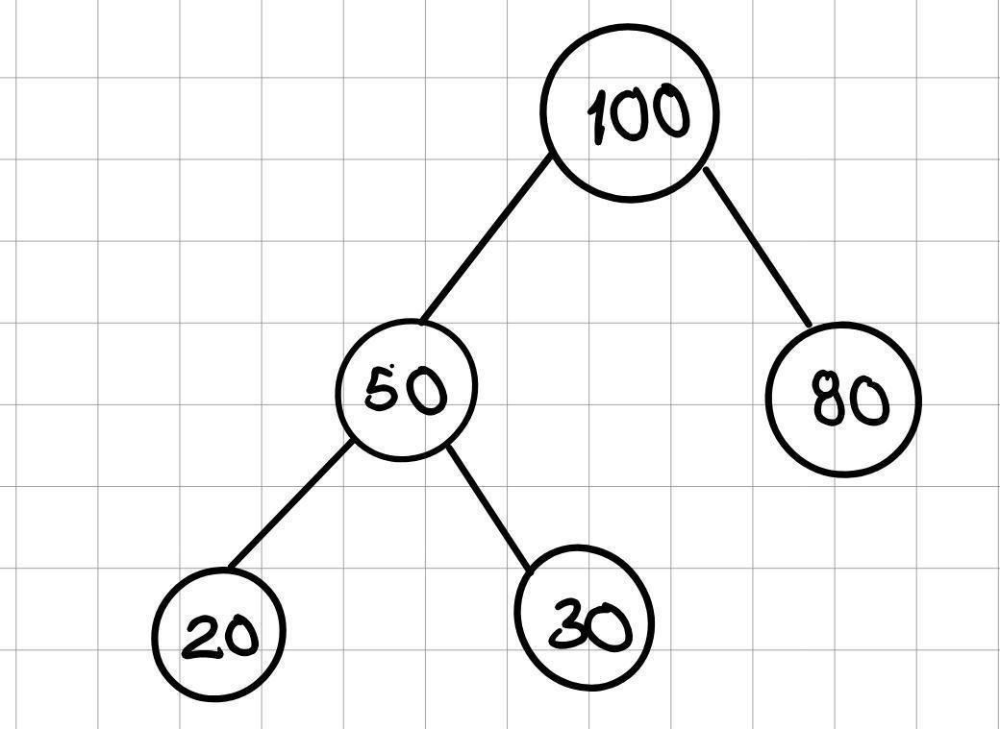
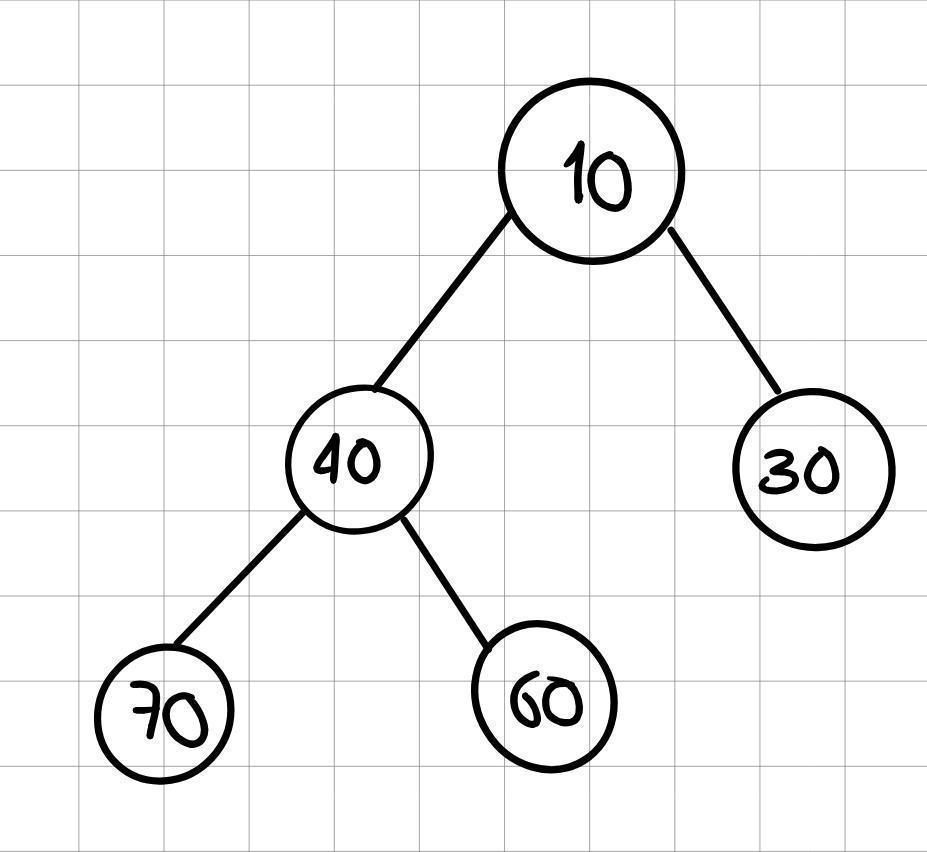
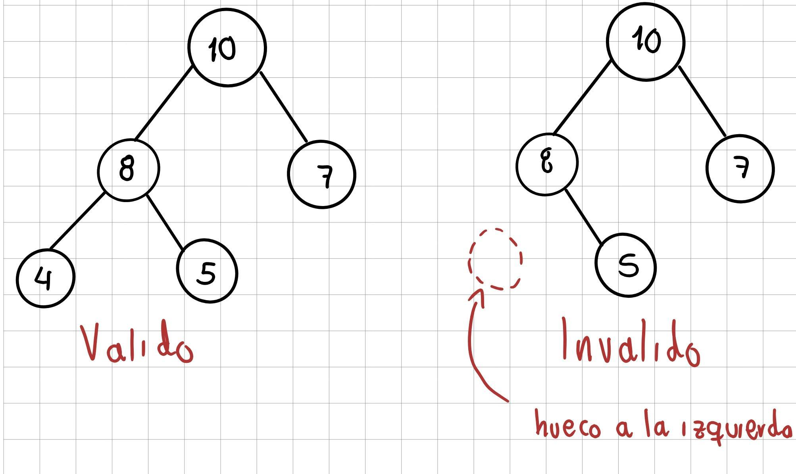
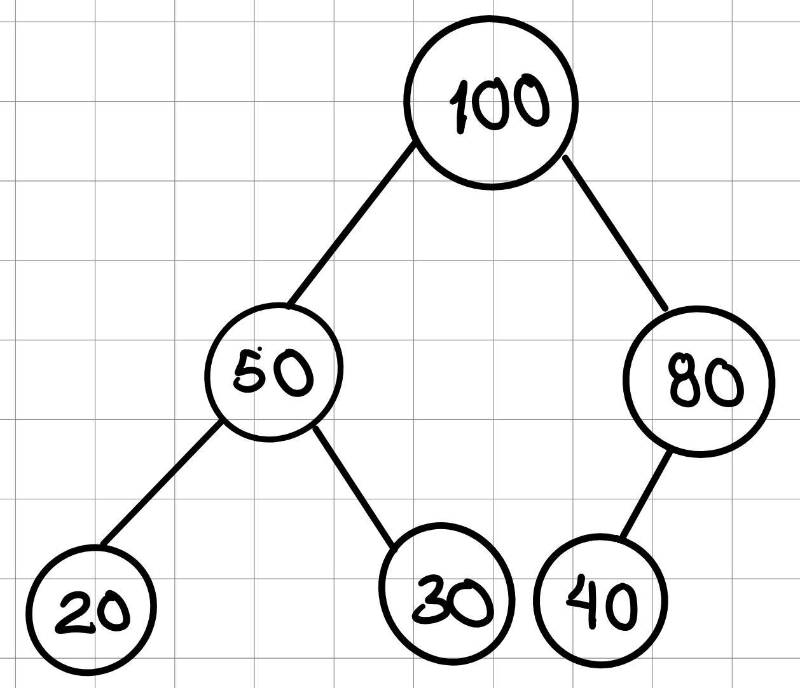
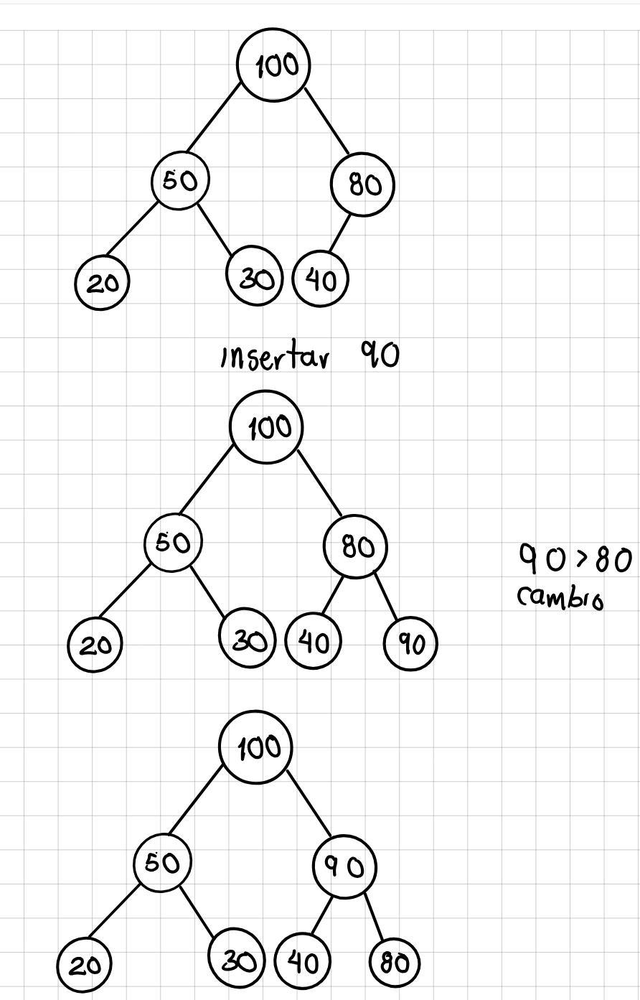
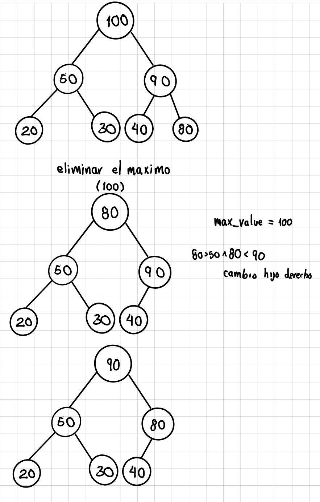

# Colas de prioridad usando montones binarios

Una cola de prioridad es una [Estructura de datos lineal](https://github.com/JDavid-Moreno/Estructuras-Lineales), está basada en una cola convencional, con la diferencia de que esta utiliza un valor de **prioridad**, por lo que el primer elemento en salir es aquel que tenga la mayor o menor (depende el caso y que se pida) prioridad, sin importar el orden de llegada, en caso de que 2 elementos tengan la misma prioridad, se definirá por quien primero (principio FIFO de las colas).

Este tema se abordó de manera superficial anteriormente, con la diferencia de que ahora usaremos un monton binario para hacerlo de manera completa.

## Monto binario

Un monto binario es un [arbol binario](https://github.com/JDavid-Moreno/Arboles-Binarios) completo que cumple una propiedad de orden, por lo que a diferencia de los árboles binarios normales, estos funcionan con otras reglas. Asi mismo, existen 2 tipos de montones binarios:

### Max Heap

El padre siempre es mayor o igual que sus hijos, asi mismo, el valor máximo se encuentra en la raiz:



### Min Heap

El padre siempre es menor o igual que sus hijos, asi mismo, el valor minimo se encuentra en la raiz:



---

Se utiliza un Heap, ya que una cola de prioridad necesita obtener y eliminar el elemento más prioritario lo más rapido posible. Por ejemplo, si queremos obtener el maximo de una lista normal costaria $O(n)$, mientras que con un heap sería de $O(1)$ para consultarlo al estar en la raiz.

Asi mismo, este debe cumplir una serie de reglas para funcionar correctamente, primero este debe ser un arbol completo o casi completo (todos los niveles del arbol deben estar completos excepto quizás el último, el cual se llena de izquierda a derecha).



Estas normas hacen que un heap no sea un arbol binario convencional, ya que al no haber un orden izquierda/derecha de hermanos, solo la relación padre-hijo importa. Por lo cual, buscar un elemento cualquiera en un heap es $O(n)$, no $O(log(n))$.

---

## Representación como un arreglo

Aquí el heap no se guarda como nodos, sino que se guarda como una lista, por lo que un arbol como este:



Se puede representar como: `[100, 50, 80, 20, 30, 40]`

Este arreglo representa cada elemento nivel por nivel, primero la raiz (nivel 0), luego sus hijos (nivel 1), luego los hijos de esos hijos (nivel 2), y asi sucesivamente.

Por lo que, gracias a esta estructura, tenemos unas fórmulas que nos ayudan a conocer las posiciones de casi cualquier nodo, suponiendo que un nodo está en la posición `i` entonces:

* **Encontrar el padre**: estará en la posición `(i - 1) // 2`
* **Encontrar el hijo izquierdo**: estará en la posición `(2 * i) + 1`
* **Encontrar el hijo derecho**: estará en la posición `(2 * i) + 2`

### Operaciones

#### Insertar

Cuando se inserta un elemento, al ser una cola, este se ingresa al final de la lista, por lo que a su vez es hijo de un nodo, por lo que tenemos que revisar si cumple la condición (que sea mayor o menor, dependiendo el caso), en caso de que si la cumpla, se queda asi.

En caso de que viole la condición usamos **sitf Up**, Es decir, este se compara y cambia de posición con su padre, asi mantenemos el monto correcto.



Hacer esto tiene una complejidad de $O(log(n))$, ya que máximo tenemos que subir hasta la altura del arbol, por lo que un arbol de 7 elementos, máximo subimos 1 o 2 niveles.

#### Eliminar la raiz

Para este caso usamos **Sift down**, primero guardamos el valor, después el último elemento de la lista lo mandamos a la raiz, ahi comparamos con sus hijos, si uno es mayor, los cambiamos de posición para que ese hijo tome su posición.



Al igual que insertar, su complejidad es de $O(log(n))$, pero a diferencia de insertar, este baja en vez de subir, pero de igual manera lo hace atravez de los niveles, por lo que de un arbol de 7 elementos solo se mueve 1 o 2 niveles.

#### Obtener el máximo o minimo

Únicamente debemos consultar la cabeza de la lista o en su defecto, el elemento del índice 0, por lo que su complejidad es de $O(1)$.

---

## Implementación

Para hacer más real la implementación, usaremos una tupla que guarde un `String` y su prioridad, con base en eso, haremos los dos casos de Max heap y Min heap.

### Max heap

Para este caso, lo mejor es separar la cola de prioridad en 2 clases, una manejará todo lo relacionado con el monton binario y la otra con todo el funcionamiento como tal de la cola, por otro lado, la clase que controla la cola, le manda a la clase de MaxHeap toda la tupla, pero con un extra que será un contador, este contador nos hara de "índice", para que en caso de que ambas prioridades sean iguales, vaya con la que entro primero, manteniendo el principio FIFO.

```
class MaxHeap:
    def __init__(self):
        self.data = []

    def __len__(self):
        return len(self.data)

    def is_empty(self):
        return len(self.data) == 0

    def father(self, i):
        return (i - 1) // 2

    def left_son(self, i):
        return  (2 * i) + 1

    def right_son(self, i):
        return (2 * i) + 2
```

Al crear la clase para `MaxHeap` usamos una lista normal y le agregamos sus funciones importantes, como su longitud, si esta vacia y las formulas para conocer el padre, y sus hijos.

#### Insertar

```
    def sift_up(self, i):
        while i > 0 and self.data[i] > self.data[self.father(i)]:
            father = self.father(i)
            self.data[i], self.data[father] = self.data[father], self.data[i]
            i = father

    def insert(self, value):
        self.data.append(value)
        self.sift_up(len(self.data) - 1)
```

Para insertar, necesitamos de **sift up** que es la que se encarga de comparar y cambiar (de ser necesario) los elementos del arbol para siempre este correcto.

#### Eliminar el máximo

```
    def sitf_down(self, i):
        n = len(self.data)
        while True:
            left = self.left_son(i)
            right = self.right_son(i)
            high = i

            if left < n and self.data[left] > self.data[high]:
                high = left
            if right < n and self.data[right] > self.data[high]:
                high = right

            if high == i:
                break

            self.data[i], self.data[high] = self.data[high], self.data[i]
            i = high

    def extract_maximum(self):
        if self.is_empty():
            print("heap vacío")
        root = self.data[0]

        last = self.data.pop()
        if self.data:
            self.data[0] = last
            self.sitf_down(0)
        return root
```

Aquí es parecido al de insertar, pero con **sitf_down** para que una vez eliminado el máximo, se reemplace la raiz por el último elemento y se compare con sus hijos para ver si está bien posicionado.

Ahora para la clase que se encarga de la cola como tal, es muy parecida, esta utiliza el contador para llevar el "índice", esto será más importante más adelante, igualmente cuenta con las funciones esenciales como saber su longitud o si está vacía.

```
class Tuple:
    def __init__(self):
        self.heap = MaxHeap()
        self.counter = 0

    def append(self, name, priority):
        insert = (priority, -self.counter, name)
        self.heap.insert(insert)
        self.counter += 1

    def next(self):
        priority, _, name = self.heap.extract_maximum()
        return name, priority

    def is_empty(self):
        return self.heap.is_empty()

    def __len__(self):
        return len(self.heap)
```

Para la función de agregar, lo que se hace es que se manda toda la tupla, pero se manda primero la prioridad para que sea el primer criterio el cual evalúa python para saber cuál es el máximo. En caso de que ambas tengan la misma prioridad, se va al segundo item que es el contador (se manda negativo, ya que como `MaxHeap` funciona que el mayor tenga más prioridad por lo que el que entro último sería primero lo cual estaría mal, por lo que se manda negativo para arreglar eso) el cual nunca es igual entre elementos por lo que ya queda ordenado. 

---

### Min Heap

Ya que `MinHeap` es en esencia lo mismo, pero con los menores, por lo que únicamente sería cambiar los signos `>`, lo haremos de otra manera, usando la libreria `heapq`.

`headpq` lo que hace es que nos da unas funciones que operan sobre una lista, las cuales mantienen las propiedades de `MinHeap`, esta solo funciona con `MinHeap` por eso `MaxHeap` se hizo desde 0. Entre las principales funciones de `heapq` esta:

`list = []`
* `heapq.heappush(list, 5)`: agregar un elemento a la lista; sin embargo, conforme se insertan elementos, este internamente hace el arbol binario para irlos organizando. por ejemplo si se inserta `5, 2, 8, 6, 3, 2, 9` en ese orden, da como resultado `[2, 3, 2, 6, 5, 8, 9]`.
* `heapq.heappop(list)`: elimina el primer elemento de la lista o en su defecto, el de mayor prioridad.
* `list[0]`: ver el elemento menor sin sacarlo de la lista.
* `heapq.heapify(lista)`: hace que cualquier lista se vuelva `MinHeap`.
* `heapq.heappushpop(list, x)`: hace un push seguido de un pop, por lo que si por ejemplo el elemento que se inserta es el minimo, sale instantáneamente, lo que lo hace más eficiente.
* `heapq.heapreplace(heap, x)`: hace un pop seguido de un push, por lo que primero se borra el minimo y luego se inserta el nuevo elemento, lo hace mas eficiente que hacer las 2 por separado.

